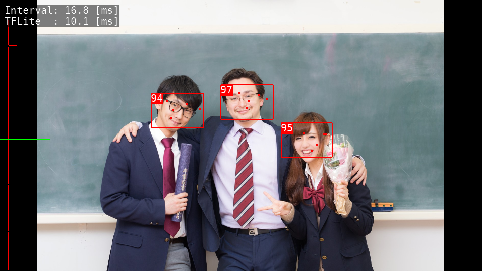
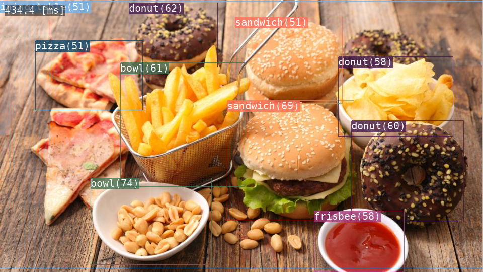
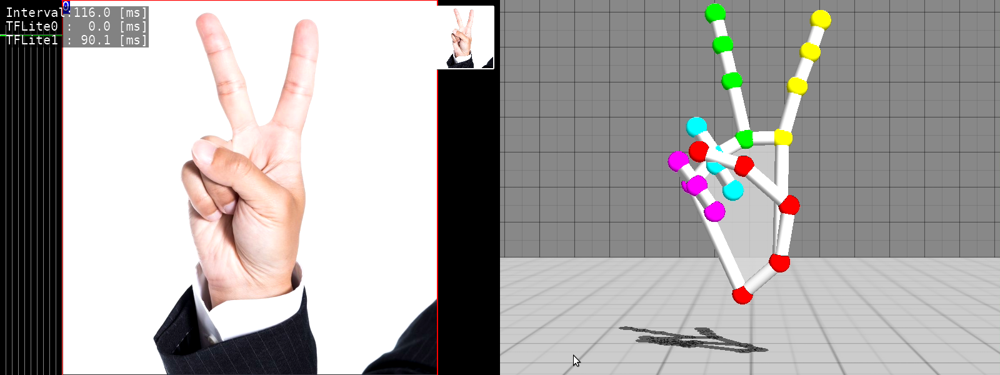
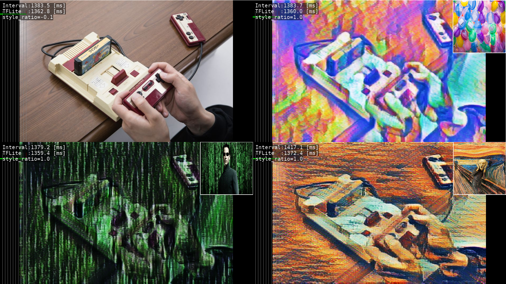

# GPU accelerated TensorFlow Lite applications.
This repository contains several applications which invoke DNN inference with **TensorFlow Lite with GPU Delegate** and visualizes its result with **OpenGLES**.

## applications
| App name    | Descriptions |
|:-----------:|:------------:|
| [gl2blazeface](https://github.com/terryky/tflite_gles_app/tree/master/gl2blazeface)          | [](https://github.com/terryky/tflite_gles_app/tree/master/gl2blazeface) <br> Lightweight Face Detection.|
| [gl2detection](https://github.com/terryky/tflite_gles_app/tree/master/gl2detection)          | [](https://github.com/terryky/tflite_gles_app/tree/master/gl2detection) <br> Object Detection using MobileNet SSD.|
| [gl2facemesh](https://github.com/terryky/tflite_gles_app/tree/master/gl2facemesh)            | [](https://github.com/terryky/tflite_gles_app/tree/master/gl2facemesh)    <br> 3D Facial Surface Geometry estimation and face replacement.|
| [gl2handpose](https://github.com/terryky/tflite_gles_app/tree/master/gl2handpose)            | [](https://github.com/terryky/tflite_gles_app/tree/master/gl2handpose)    <br> 3D Handpose Estimation from single RGB images.|
| [gl2posenet](https://github.com/terryky/tflite_gles_app/tree/master/gl2posenet)              | [](https://github.com/terryky/tflite_gles_app/tree/master/gl2posenet)       <br> Pose Estimation.|
| [gl2segmentation](https://github.com/terryky/tflite_gles_app/tree/master/gl2segmentation)    | [](https://github.com/terryky/tflite_gles_app/tree/master/gl2segmentation) <br> Semantic image segmentation using Deeplab.|
| [gl2style_transfer](https://github.com/terryky/tflite_gles_app/tree/master/gl2style_transfer)| [](https://github.com/terryky/tflite_gles_app/tree/master/gl2style_transfer) <br> Artistic Style Transfer.|


## How to Build & Run

- [Build for x86_64 Linux](#build_for_x86_64)
- [Build for Jetson Nano (aarch64 )](#build_for_jetson_nano)
- [Build for Raspberry Pi 4 (armv7l)](#build_for_raspi4)


### <a name="build_for_x86_64">Build for x86_64 Linux</a>

##### 1.setup environment
```
$ sudo apt install libgles2-mesa-dev 
$
$ wget https://github.com/bazelbuild/bazel/releases/download/2.0.0/bazel-2.0.0-installer-linux-x86_64.sh
$ chmod 755 bazel-2.0.0-installer-linux-x86_64.sh
$ sudo ./bazel-2.0.0-installer-linux-x86_64.sh
```

##### 2.build TensorFlow Lite library.

```
$ cd ~/work 
$ git clone https://github.com/terryky/tflite_gles_app.git
$ ./tflite_gles_app/tools/scripts/tf2.2/build_libtflite_r2.2.sh

(Tensorflow configure will start after a while. Please enter according to your environment)

$
$ ln -s tensorflow_r2.2 ./tensorflow
```

##### 3.build an application.

```
$ cd ~/work/tflite_gles_app/gl2handpose
$ make -j4
```

##### 4.run an application.

```
$ cd ~/work/tflite_gles_app/gl2handpose
$ ./gl2handpose
```


### <a name="build_for_jetson_nano">Build for Jetson Nano (aarch64)</a>

##### 1.build TensorFlow Lite library on **Host PC**.

```
(HostPC)$ wget https://github.com/bazelbuild/bazel/releases/download/2.0.0/bazel-2.0.0-installer-linux-x86_64.sh
(HostPC)$ chmod 755 bazel-2.0.0-installer-linux-x86_64.sh
(HostPC)$ sudo ./bazel-2.0.0-installer-linux-x86_64.sh
(HostPC)$
(HostPC)$ cd ~/work 
(HostPC)$ git clone https://github.com/terryky/tflite_gles_app.git
(HostPC)$ ./tflite_gles_app/tools/scripts/tf2.2/build_libtflite_r2.2_with_gpu_delegate_aarch64.sh

(Tensorflow configure will start after a while. Please enter according to your environment)
```

##### 2.copy libtensorflow-lite.a to target Jetson.

```
(HostPC)scp ~/work/tensorflow_r2.2/tensorflow/lite/tools/make/gen/linux_aarch64/lib/libtensorflow-lite.a jetson@192.168.11.11:/home/jetson/
```

##### 3.clone Tensorflow repository on **target Jetson**.

```
(Jetson)$ cd ~/work
(Jetson)$ git clone https://github.com/tensorflow/tensorflow.git
(Jetson)$ cd tensorflow
(Jetson)$ git checkout r2.2
(Jetson)$ ./tensorflow/lite/tools/make/download_dependencies.sh
```


##### 4.build an application.

```
(Jetson)$ cd ~/work 
(Jetson)$ git clone https://github.com/terryky/tflite_gles_app.git
(Jetson)$ cd ~/work/tflite_gles_app/gl2handpose
(Jetson)$ cp ~/libtensorflow-lite.a .
(Jetson)$ make -j4 TARGET_ENV=jetson_nano TFLITE_DELEGATE=GPU_DELEGATEV2
```

##### 5.run an application.

```
(Jetson)$ cd ~/work/tflite_gles_app/gl2handpose
(Jetson)$ ./gl2handpose
```

##### about VSYNC
On Jetson Nano, display sync to vblank (VSYNC) is enabled to avoid the tearing by default .
To enable/disable VSYNC, run app with the following command.
```
# enable VSYNC (default).
(Jetson)$ export __GL_SYNC_TO_VBLANK=1; ./gl2handpose

# disable VSYNC. framerate improves, but tearing occurs.
(Jetson)$ export __GL_SYNC_TO_VBLANK=0; ./gl2handpose
```


### <a name="build_for_raspi4">Build for Raspberry Pi 4 (armv7l)</a>

##### 1.build TensorFlow Lite library on **Host PC**.

```
(HostPC)$ wget https://github.com/bazelbuild/bazel/releases/download/2.0.0/bazel-2.0.0-installer-linux-x86_64.sh
(HostPC)$ chmod 755 bazel-2.0.0-installer-linux-x86_64.sh
(HostPC)$ sudo ./bazel-2.0.0-installer-linux-x86_64.sh
(HostPC)$
(HostPC)$ cd ~/work 
(HostPC)$ git clone https://github.com/terryky/tflite_gles_app.git
(HostPC)$ ./tflite_gles_app/tools/scripts/tf2.2/build_libtflite_r2.2_with_gpu_delegate_rpi.sh

(Tensorflow configure will start after a while. Please enter according to your environment)
```

##### 2.copy libtensorflow-lite.a to target Raspberry Pi 4.

```
(HostPC)scp ~/work/tensorflow_r2.2/tensorflow/lite/tools/make/gen/rpi_armv7l/lib/libtensorflow-lite.a pi@192.168.11.11:/home/pi/
```

##### 3.setup environment on **Raspberry Pi 4**.

```
(Raspi)$ sudo apt install libgles2-mesa-dev libegl1-mesa-dev xorg-dev
(Raspi)$ sudo apt update
(Raspi)$ sudo apt upgrade
```


##### 4.clone Tensorflow repository on **target Raspi**.

```
(Raspi)$ cd ~/work
(Raspi)$ git clone https://github.com/tensorflow/tensorflow.git
(Raspi)$ cd tensorflow
(Raspi)$ git checkout r2.2
(Raspi)$ ./tensorflow/lite/tools/make/download_dependencies.sh
```


##### 5.build an application on **target Raspi**..

```
(Raspi)$ cd ~/work 
(Raspi)$ git clone https://github.com/terryky/tflite_gles_app.git
(Raspi)$ cd ~/work/tflite_gles_app/gl2handpose
(Raspi)$ cp ~/libtensorflow-lite.a .
(Raspi)$ make -j4 TARGET_ENV=raspi4  #disable GPUDelegate. (recommended)

#enable GPUDelegate. but it cause low performance on Raspi4.
(Raspi)$ make -j4 TARGET_ENV=raspi4 TFLITE_DELEGATE=GPU_DELEGATEV2
```


##### 6.run an application on **target Raspi**..

```
(Raspi)$ cd ~/work/tflite_gles_app/gl2handpose
(Raspi)$ ./gl2handpose
```


for more detail infomation, please refer [this article](https://qiita.com/terryky/items/fa18bd10cfead076b39f).


## UVC Camera support
- UVC(USB Video Class) camera capture is supported. (currently, YUYV pixelformat only)
- Use ```v4l2-ctl``` command to configure the capture resolution.

lower the resolution, higher the framerate.
```
$ sudo apt-get install v4l-utils
$ v4l2-ctl --set-fmt-video=width=160,height=120
```

- If you have error messages like below:

```
-------------------------------
 capture_devie  : /dev/video0
 capture_devtype: V4L2_CAP_VIDEO_CAPTURE
 capture_buftype: V4L2_BUF_TYPE_VIDEO_CAPTURE
 capture_memtype: V4L2_MEMORY_MMAP
 WH(640, 480), 4CC(MJPG), bpl(0), size(341333)
-------------------------------
ERR: camera_capture.c(80): not supported.
ERR: camera_capture.c(80): not supported.
...
```

please try to change your camera settings to use YUYV pixelformat like following command :

```
$ sudo apt-get install v4l-utils
$ v4l2-ctl --set-fmt-video=width=640,height=480,pixelformat=YUYV --set-parm=30
```

If your camera doesn't support YUYV, please run the apps in camera_disabled_mode with argument ```-x```
```
$ ./gl2handpose -x
```


## tested platforms
You can select the platform by editing [Makefile.env](Makefile.env).
- Linux PC (X11)
- NVIDIA Jetson Nano (X11)
- NVIDIA Jetson TX2 (X11)
- RaspberryPi4 (X11)
- RaspberryPi3 (Dispmanx)
- Coral EdgeTPU Devboard (Wayland)
